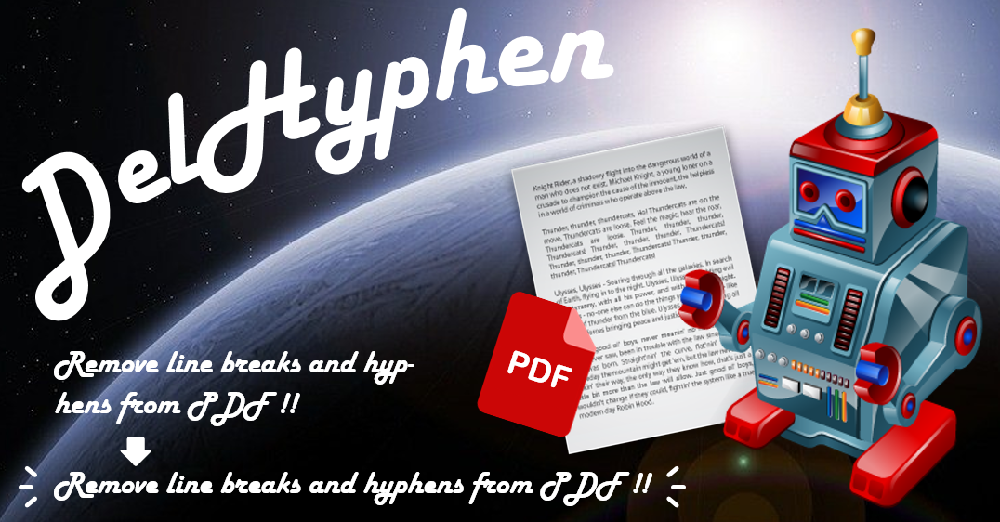

# DelHyphen

  
Remove line breaks and hyphenation from PDF.  
For more details on DelHyphen, please go to [http://pc-chem-basics.blog.jp/archives/26966070.html](http://pc-chem-basics.blog.jp/archives/26966070.html)
